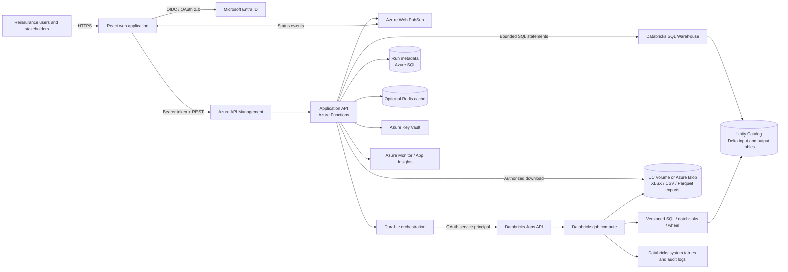
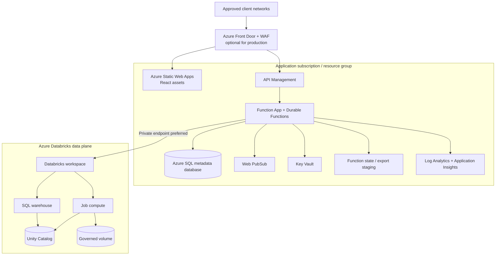

# Target Architecture

## 1. Architecture recommendation

Use a browser-to-backend-to-Databricks architecture. The React application calls an authenticated application REST API. That API validates authorization, records the run, and invokes the Databricks Jobs API with a service identity. Databricks performs the expensive computation and writes durable results to Unity Catalog. The UI receives status events, requests only bounded result pages, and downloads a pre-generated export.

Direct browser-to-Databricks integration is rejected because it would expose or complicate credentials, couple the UI to infrastructure APIs, weaken business authorization and audit controls, and make long-running orchestration unreliable.

## 2. Logical architecture

## 3. Deployment view

The POC may omit Front Door, private endpoints, Redis, and zone-redundant tiers if cost or subscription limits require it. Their interfaces remain represented so production hardening is additive.

## 4. Component responsibilities

| Component | Responsibilities | Must not do |
|---|---|---|
| React UI | Authentication flow, model selection, parameter forms, status/history display, virtualized result grid, download initiation | Hold Databricks secrets; execute model SQL; download all rows for display |
| Entra ID | User authentication, tokens, groups/application roles | Store application run state |
| API Management | Token validation, routing, throttling, request limits, API versioning, correlation headers | Orchestrate two-hour jobs |
| Application API | Business authorization, validation, idempotency, run CRUD, result-page contract, secure download authorization | Perform large joins or materialize huge files in API memory |
| Durable Functions | Reliable asynchronous steps, retries, timers, reconciliation, export coordination | Become the system of record for analytical output |
| Run metadata store | Fast run listing, lifecycle state, ownership, timestamps, references, safe errors, audit state | Duplicate complete analytical results |
| Databricks Jobs | Parameterized computation, data-quality validation, output publication, export generation | Accept arbitrary unvalidated SQL from users |
| SQL Warehouse | Small metadata queries and bounded result-page queries | Hold synchronous browser connections for model execution |
| Unity Catalog | Governed source/output tables, access policies, lineage, volumes | Replace application authorization or UI metadata |
| Web PubSub | Lightweight status notifications | Carry result rows or sensitive error payloads |
| Key Vault | Secrets/certificates only when managed identity/federation cannot remove them | Store normal application configuration |

## 5. Why Databricks Jobs for model execution

The SQL Statement Execution API is appropriate for short, bounded, interactive statements. It is not the primary orchestration mechanism for 12-minute to two-hour workflows with multiple steps, retries, compute dependencies, quality checks, output publishing, and export generation.

Databricks Jobs provide:

- asynchronous run IDs and lifecycle state;
- task dependencies and conditional execution;
- job clusters or serverless job compute;
- retries, timeouts, cancellation, and repair runs;
- parameter passing and versioned deployment definitions;
- operational history and linkage to logs;
- separation between application request handling and analytical compute.

Use the SQL Statement API through the backend for model catalog lookups where appropriate and for constrained result paging. Never leave an HTTP request waiting for a model run to finish.

## 6. Model packaging recommendation

Prefer a multi-task Databricks job template per model family or a shared parameterized job when models have the same lifecycle:

1. `validate_parameters_and_access`
2. `prepare_inputs`
3. `execute_model`
4. `quality_checks`
5. `publish_output`
6. `build_summary`
7. `generate_export`
8. `finalize_manifest`

Keep SQL and orchestration definitions in source control. Deploy them through CI/CD using Databricks Asset Bundles or the organization's approved infrastructure/deployment mechanism. Unity Catalog can store governed tables and files, but it should not be the only source-control location for SQL scripts.

## 7. Core architecture decisions

### ADR-001: backend mediation

- Decision: all Databricks and storage access is mediated by the backend.
- Reason: credential isolation, centralized authorization, stable API contract, auditing, throttling, and error normalization.
- Consequence: the backend is a critical service and requires scaling, monitoring, and resilient status reconciliation.

### ADR-002: asynchronous execution

- Decision: model submissions return `202 Accepted` with an application run ID.
- Reason: execution lasts far beyond normal HTTP and browser lifetimes.
- Consequence: persistent states, idempotency, notifications, polling, and cancellation are first-class features.

### ADR-003: Jobs API over direct SQL for models

- Decision: Databricks Jobs executes long-running model logic.
- Reason: workflow controls, observability, retries, task decomposition, and durability.
- Consequence: model code must be packaged and deployed as a job artifact.

### ADR-004: separate metadata and analytical data

- Decision: Azure SQL is recommended for responsive application metadata; Unity Catalog stores analytical results.
- Reason: run-list APIs have transactional access patterns and should not depend on warehouse startup/query latency.
- POC alternative: a Unity Catalog control table can reduce components, but increases coupling and may produce slower UI behavior.

### ADR-005: immutable per-run results

- Decision: successful results are addressed by run ID and not overwritten by later runs.
- Reason: reproducibility, audit, downloads, and comparisons.
- Consequence: retention and cleanup automation are required.

### ADR-006: generated files, not browser-built files

- Decision: Databricks or an asynchronous export worker creates download files.
- Reason: browser/API memory safety and predictable handling of 500,000+ rows.
- Consequence: export has its own lifecycle and can finish after result publication.

## 8. Environment strategy

- Separate development, test, and production resource configurations.
- Prefer separate production Databricks workspace/catalog or, at minimum, strongly separated catalogs, schemas, service principals, external locations, and policies.
- Never copy production secrets or unrestricted production data into lower environments.
- Use synthetic or masked reinsurance data for local and automated tests.
- Promote versioned application artifacts, infrastructure, Databricks bundle/job definitions, and schema migrations through environments.

