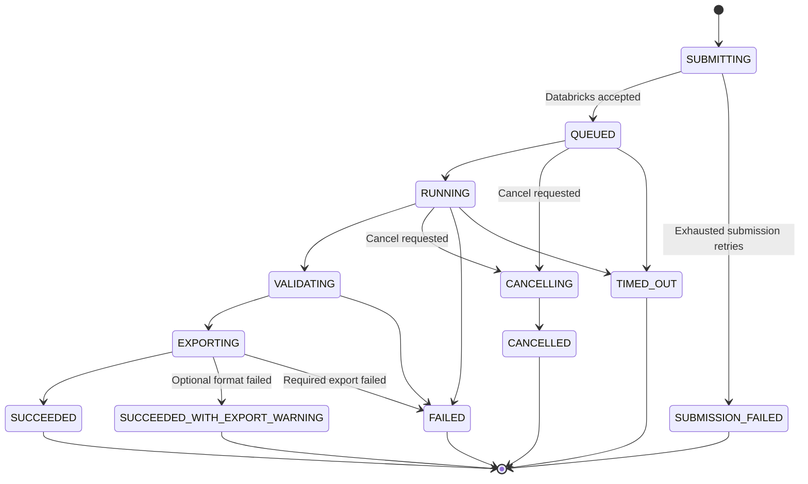

# Run and Data Design

## 1. End-to-end execution sequence

```mermaid
sequenceDiagram
    autonumber
    actor User
    participant UI as React UI
    participant API as Application API
    participant Meta as Run metadata DB
    participant DBX as Databricks Jobs API
    participant Job as Databricks Job
    participant UC as Unity Catalog
    participant Export as Governed file storage
    participant Push as Web PubSub

    User->>UI: Select model and enter parameters
    UI->>API: POST /v1/runs + Idempotency-Key
    API->>API: Authenticate, authorize, validate
    API->>Meta: Insert SUBMITTING run
    API->>DBX: Start job with run_id and parameters
    DBX-->>API: Databricks run ID
    API->>Meta: Set QUEUED and save external run ID
    API-->>UI: 202 Accepted + application run ID

    loop Until terminal
        API->>DBX: Reconcile Databricks lifecycle state
        DBX-->>API: Queued / running / terminated
        API->>Meta: Conditional state update
        API->>Push: Publish run status event
        Push-->>UI: Invalidate/refetch run status
    end

    Job->>UC: Read governed source tables
    Job->>Job: Execute joins, rules, and model logic
    Job->>UC: Write staging Delta output
    Job->>Job: Validate row counts and quality rules
    Job->>UC: Atomically publish immutable run output
    Job->>Export: Generate XLSX and optional CSV/Parquet
    Job->>UC: Write run manifest and summary
    API->>Meta: Record output refs; set SUCCEEDED
    API->>Push: Publish completion event
    Push-->>UI: Refresh summary and result page

    User->>UI: Open Results
    UI->>API: GET /v1/runs/{id}/results?cursor=...
    API->>UC: Execute bounded authorized query
    UC-->>API: One page + next cursor
    API-->>UI: Rows + schema + cursor

    User->>UI: Download
    UI->>API: POST /v1/runs/{id}/downloads
    API->>API: Re-authorize run and file
    API-->>UI: Short-lived download response/link
```

Status push is an optimization, not a source of truth. The UI refetches from the API after every event and falls back to bounded polling with exponential backoff and jitter.

## 2. Run state machine



State transitions are monotonic and guarded using optimistic concurrency. Out-of-order callbacks or polling responses cannot move a terminal run back to `RUNNING`.

## 3. Identity and correlation keys

- `run_id`: application-generated UUID; primary user-facing and cross-system correlation identifier.
- `databricks_run_id`: external Databricks identifier; never used alone for application authorization.
- `model_id`: stable business identifier.
- `model_version`: immutable deployed version used for reproducibility.
- `request_id`: per-HTTP-request correlation identifier.
- `idempotency_key`: client-generated value for safe submission retry.
- `output_table` and `export_manifest_uri`: internal references stored only after successful publication.

Pass `run_id`, model version, initiating user object ID, and sanitized parameter references into the Databricks job as tags/parameters where supported. Do not pass bearer tokens or secrets as job parameters.

## 4. Metadata model

### `models`

| Field | Notes |
|---|---|
| `model_id` | Stable identifier |
| `display_name`, `description` | Business copy |
| `version` | Published immutable version |
| `job_id` | Server-side Databricks job mapping |
| `parameter_schema_json` | JSON Schema-like definition |
| `result_schema_version` | Output contract version |
| `authorization_policy` | Required app role/group mapping |
| `expected_duration_minutes` | UI guidance only |
| `is_active` | Controls discoverability/submission |

### `runs`

| Field | Notes |
|---|---|
| `run_id` | UUID primary key |
| `model_id`, `model_version` | Exact execution definition |
| `requested_by_object_id` | Entra immutable object ID |
| `requested_by_display_name` | Snapshot for display; not authorization |
| `team_scope` | Optional visibility boundary |
| `parameters_json` | Sanitized values; encrypt/classify as required |
| `status`, `status_version` | State and optimistic-lock version |
| `created_at`, `queued_at`, `started_at`, `completed_at` | UTC timestamps |
| `databricks_run_id` | External correlation |
| `result_table_ref` | Allow-listed internal table reference |
| `row_count`, `column_count` | Validated output counts |
| `summary_json` | Small UI-ready metrics only |
| `export_status`, `export_manifest_ref` | Download lifecycle |
| `error_code`, `safe_error_message` | No stack trace or sensitive values |
| `correlation_id` | Support lookup |
| `expires_at`, `deleted_at` | Retention lifecycle |

### `run_events`

Append-only lifecycle/audit events: event ID, run ID, previous/new state, source, actor/service identity, UTC timestamp, correlation ID, and safe details. Do not store large Databricks logs here.

### `export_artifacts`

One row per artifact: run ID, format, URI/reference, size, checksum, row count, sheet/file count, creation time, expiry, and status.

## 5. Unity Catalog organization

Illustrative naming; final names follow enterprise standards:

```text
<catalog>
  source_reinsurance          governed source tables/views
  model_work                  transient or checkpoint data
  model_results               immutable detailed outputs
  model_summary               small summaries and quality outcomes
  model_control               optional Databricks-side manifests

<volume>
  exports/<model_id>/<yyyy>/<mm>/<run_id>/manifest.json
  exports/<model_id>/<yyyy>/<mm>/<run_id>/result.xlsx
  exports/<model_id>/<yyyy>/<mm>/<run_id>/result-part-*.csv.gz
```

Two physical result patterns are acceptable:

### Shared Delta table, recommended when schemas align

Append every output with mandatory `run_id`, `model_id`, `model_version`, and timestamps. Partition or cluster based on measured query behavior, commonly `run_id` plus selective business fields. This simplifies operations and schema management.

### Table per run, only when isolation/schema variance requires it

Creates strong physical separation but can produce excessive catalog objects and operational overhead. Use a strict allow-listed naming function and lifecycle cleanup.

Do not partition blindly on high-cardinality columns. Use Delta optimization/liquid clustering based on actual result paging and filter predicates.

## 6. Atomic output publication

1. Write to a staging table/path keyed by `run_id`.
2. Capture input snapshots/versions and model version.
3. Run schema, nullability, uniqueness, row-count, reconciliation, and business quality checks.
4. Write a compact summary and manifest.
5. Publish via an atomic Delta commit/table reference update.
6. Mark the application run successful only after the published table/reference is readable.
7. Clean abandoned staging outputs through a scheduled retention process.

The manifest should include run ID, model/version, schema version, input versions, start/end times, row count, quality-check outcomes, output location, artifact checksums, and code/deployment revision.

## 7. Result querying and pagination

Offset pagination becomes increasingly expensive and unstable for large datasets. Prefer cursor/keyset pagination:

- Define a deterministic sort order ending in a unique tie-breaker such as `result_row_id`.
- Return an opaque signed cursor containing the final sort keys and query/filter fingerprint.
- Reject a cursor if filters, sort, run, user scope, or schema version differ.
- Limit selectable columns, operators, sort fields, page size, query duration, and scanned data.
- Parameterize values; construct identifiers only from a server-side allow-list.
- Cache the first page and small summaries only when authorization and freshness keys are included.

The browser grid should virtualize rendered rows, but virtualization does not replace server pagination. The UI retains only a few pages and aborts obsolete requests when users change filters.

## 8. XLSX and heavy export strategy

Excel limits a worksheet to 1,048,576 rows. Practical workbook limits can be lower because memory, formatting, columns, and file size affect usability.

Recommended behavior:

- Create exports asynchronously after output validation.
- Use a streaming writer; never assemble the entire workbook in memory.
- Split large results into clearly named sheets before reaching the per-sheet limit.
- Repeat headers and include an `About` sheet with model, run, generation time, filters, row count, and schema/version metadata.
- Apply restrained formatting; avoid per-cell styles that inflate files.
- For outputs that exceed an agreed workbook threshold, generate ZIP-compressed CSV parts and/or Parquet in addition to XLSX.
- Store checksum, byte size, row count, part/sheet count, and expiry in the artifact manifest.
- Serve through a backend authorization check followed by a short-lived SAS/presigned URL or controlled stream.
- Sanitize filenames and cell values that begin with formula-control characters (`=`, `+`, `-`, `@`) when business text is exported, to reduce spreadsheet formula injection risk.

## 9. Idempotency and retries

- Require an `Idempotency-Key` for `POST /runs`.
- Scope it to caller and endpoint; retain it at least through the maximum client retry window.
- Store a hash of the normalized request. Reuse with the same payload returns the original run; reuse with a different payload returns `409 Conflict`.
- Retry transient Databricks/API failures with exponential backoff, jitter, and a maximum attempt count.
- Never retry an ambiguous submission by blindly creating a new run. Reconcile using the application run ID/tag first.
- Make export generation idempotent by writing to a run-specific location and recording checksums/manifests.

## 10. Retention and cleanup

Retention is policy-driven and must be finalized with compliance owners. Separate periods may apply to:

- run metadata and audit events;
- detailed Delta results;
- exports and temporary staging files;
- application and Databricks logs;
- failed-run diagnostics.

Cleanup jobs must be observable, resumable, and ordered: expire download access, delete artifacts, delete result data when permitted, retain required audit metadata, then record deletion completion. Legal hold overrides normal cleanup.

